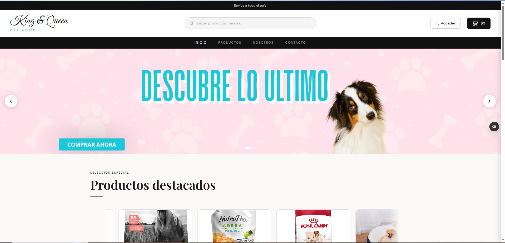
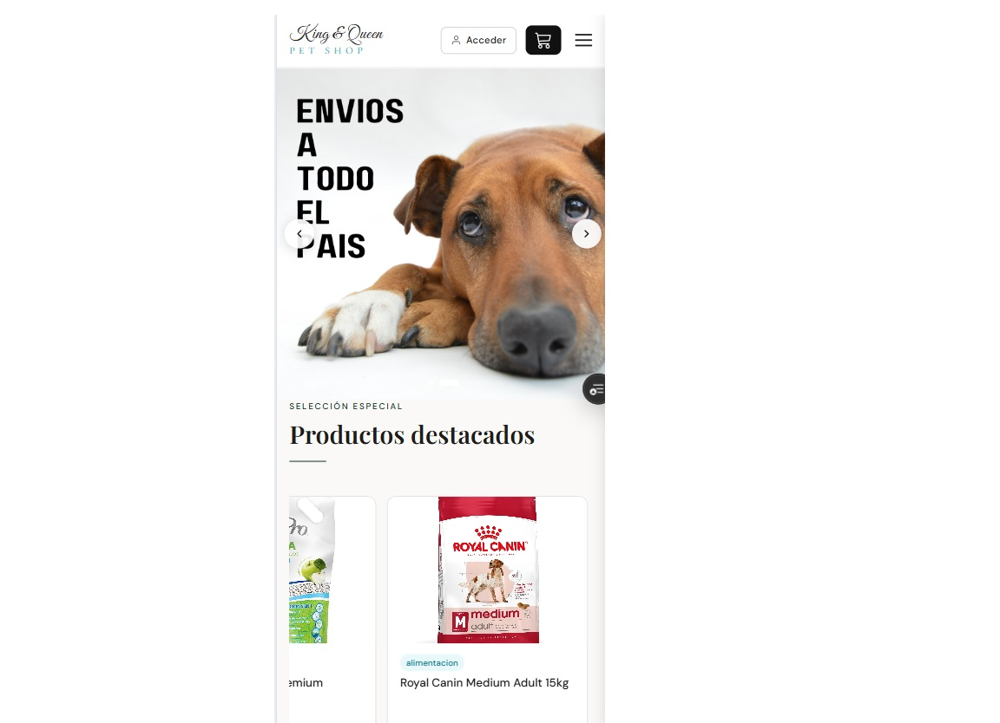
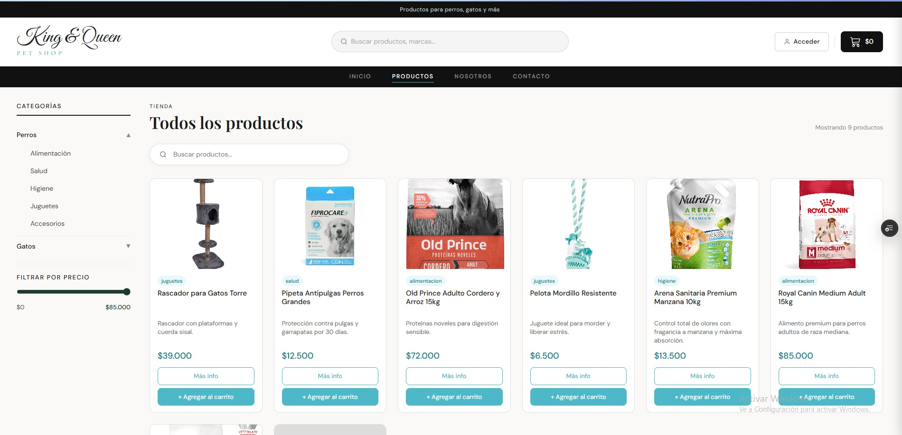
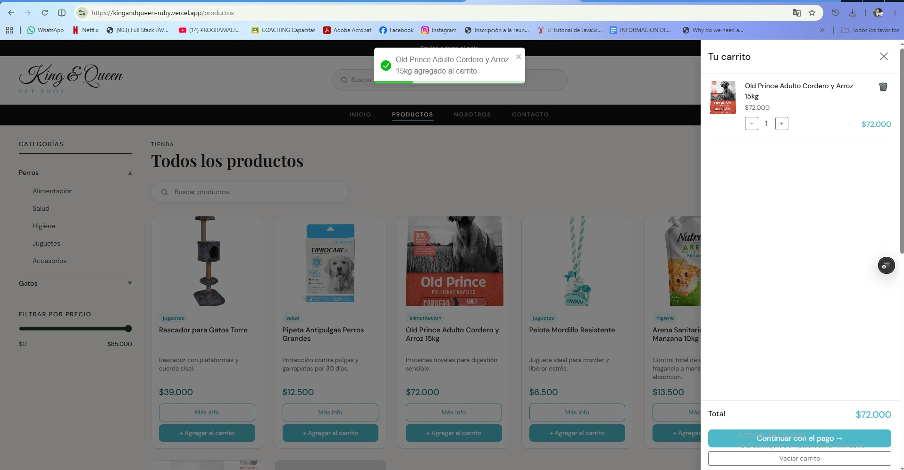

#  King & Queen Pet Shop

Ecommerce desarrollado en React para una tienda de artículos y peluquería canina ubicada en Buenos Aires, Argentina.

🔗 **Demo en vivo:** https://kingandqueen-ruby.vercel.app/

## Tecnologías utilizadas

- React
- React Router DOM
- Context API (manejo de estado global)
- Firebase Authentication (login de usuarios)
- Firestore (base de datos)
- Cloudinary (almacenamiento de imágenes)
- Bootstrap 5
- Vite
- Servicio de email (notificaciones de pedidos)
- Deploy en Vercel

## Instalación y uso

1. Clonar el repositorio

```bash
git clone https://github.com/CammiBarletta/kingandqueen.git
```

2. Instalar dependencias

```bash
npm install
```

3. Configurar variables de entorno

Crear un archivo `.env` en la raíz con las credenciales de Firebase y Cloudinary:

```
VITE_FIREBASE_API_KEY=
VITE_FIREBASE_AUTH_DOMAIN=
VITE_FIREBASE_PROJECT_ID=
VITE_CLOUDINARY_CLOUD_NAME=
...
```

4. Correr el proyecto

```bash
npm run dev
```

5. Abrir en el navegador

```
http://localhost:5173
```

## Capturas

| Inicio (Desktop) | Inicio (Mobile) |
|---|---|
|  |  |

| Listado de productos | Carrito |
|---|---|
|  |  |

## Funcionalidades

- Listado de productos desde Firestore
- Detalle de producto individual
- Carrito de compras con manejo de cantidades (Context API)
- Autenticación de usuarios con Firebase Auth
- Navbar con dos niveles y carrito en tiempo real
- Carrusel de productos destacados
- Panel de administración (alta/edición de productos)
- Filtro por categorías
- Buscador de productos
- Finalización de compra por WhatsApp
- Envío de notificaciones por email ante nuevos pedidos
- Navegación entre páginas sin recarga (SPA)
- Diseño responsive mobile-first con Bootstrap
- Deploy continuo en Vercel

## Próximamente

- Verificación de responsive design en dispositivos reales
- Mejoras de SEO
- Revisión de reglas de seguridad de Firestore

## Desarrolla

Camila Barletta
[@CammiBarletta](https://github.com/CammiBarletta)